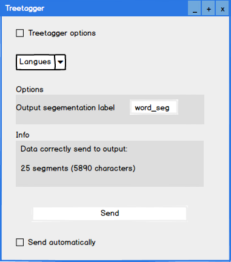
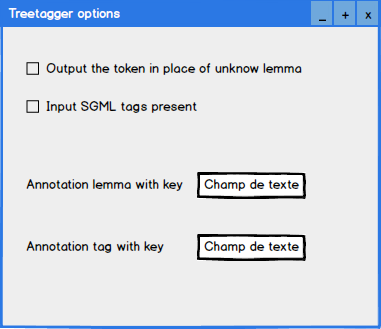

#########################################
Specification: Widget Textable TreeTagger
#########################################

1 Introduction
**************

1.1 But du projet
=================
Créer un Widget Textable Treetagger qui utilise TreeTagger_ pour annoter un texte segmenté.

.. [#] Dernière version en python 2 disponible
.. _TreeTagger: http://www.cis.uni-muenchen.de/~schmid/tools/TreeTagger/

1.2 Aperçu des etapes
=====================
* Premiere version de la specification: 17 mars 2016
* Remise de la specification: 24 mars 2016
* Version alpha du projet:  28 avril 2016
* Remise et presentation du projet:  26 mai 2016

1.3 Equipe et responsabilitées
==============================

* Xavier Barros: xavier.barros@unil.ch
        * code
        * test
       

* Fiona Testuz: fiona.testuz@unil.ch
        * code
        * documentation
        * spécification
        * interface
        
* Michael Wuethrich: michael.t.wuethrich@live.fr
        * test
        * code
        * spécification
        * github Boss
        
* Chloe Beutler: chloe.beutler@unil.ch
        * code
        * documentation
        * spécification
        
* Gaétan Schneider: gaetan.schneider@unil.ch
        * code
        * documentation
        * spécification
        
* Jocelin Pitteloud: jocelin.pitteloud@unil.ch
        * code
        * test
        * documentation 

2. Technique
************
Orange 2.7
Orange Textable 1.5.2
Treetagger  
Python Subprocess https://docs.python.org/2/library/subprocess.html

2.1 Mock-up de l'interface
==========================

.. image:: img/Path_treetagger.png

2.2 Fonctionnalités minimales
=============================
* input: segments textes
Possibilité d'extraire l'annotation du segments (par exemple annotation titre) afin de pouvoir par la suite situer le segment dans le texte

* Entrée dans le widgets:
Interface demandant à l'utilisateur où est placé treetagger dans son ordinateur (chemin d'accès)
ainsi que les options d'analyse choisies (2 langues à choix, output for each token, input option...??)

* Opérations du widget:
1. Envoi l'information au logiciel treetagger
2. Récupère l'information en segmentation

* output: segments en mots annotées (annotation: TAG, annotation: segment d'entrée)
  
   
   | segment 1 PHRASE | 
                            -->  | Mot 1 | annotation: segment: 1 | annotation: TAG: NOM |
   
   | segment 2 TEXTE  |
  
  

2.3 Fonctionnalités principales
===============================
* Depuis un widget d'entrée (text files), notre widget treetagger va ressortir une segmentation avec annotation de un ou plusieurs textes selon sa position et son tag.
* Segmentation Treetagger
* Utilisation de lemmes
* Output autant de segmentations que de tokens
* Options de 2 langues à choix, output for each token, input option,.. TODO
* Choix de langue, français par défaut (anglais en plus si tout fonctionne)
* Si un widget treetagger est déjà utilisé dans le travail en cours, ne pas redemander le lien pour treetagger et réutiliser celui entré précédemment.

2.4 Fonctionnalités optionelles
===============================
* ajouter d'autres options treetagger

2.5 Tests
=========
Le widget fonctionne si les fonctionnalités minimales et principales fonctionnent (2.2 et 2.3)
Tests initaux avec python script pour faire appel à treetagger afin de définir différentes fonctionalités

TODO

3. Etapes
*********
* Phase 1
        * Création d'un compte Github
        * Cahier des charges
        * Installation de Treetagger
        * Interface
        * Recherche, tests initiaux et documentation

* Phase 2
        * Codage 
        * Intégration à Orange Textable

* Phase 3
        * Tester le widget raccourci Treetagger 
        * Le raccourci Treetagger passe par la fonction recode 
        * Une fois le recode accompli, utilisation de la fonction xml

3.1 Version alpha
=================
* L'interface graphique est complétement construite.
* Les fonctionnalités minimales sont prises en charge par le logiciel.

3.2 Remise et présentation
==========================
* Les fonctionnalités principales sont complétement prises en charge par le logiciel.
* La documentation du logiciel est complète.
* Le logiciel possède des routines de test de ses fonctionnalitées (principales ou optionelles)

4. Infrastructure
=================
Le projet est disponible sur GitHub à l'adresse https://github.com/fio818/Treetagger-Widget 
